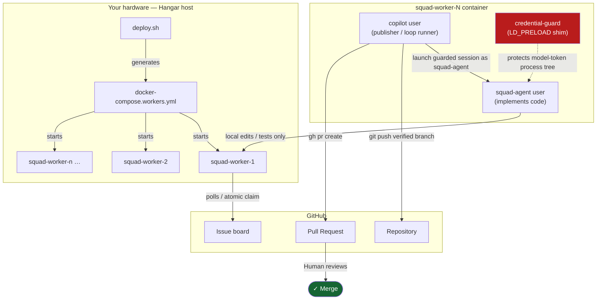

<div align="center">
  
  <h1>Hangar</h1>
  <p><strong>Where your copilots live, get fueled up, and launch.</strong></p>
  <p><em>The self-hosted flight deck for coding agents.</em></p>
  <p>Your hardware. Your repositories. Your merge button.</p>

  <p>
    
    
    
    
  </p>
</div>

---

> **⚠️ Security notice.** Worker containers run AI-generated code and open real pull requests
> against your repositories. Review the [Security model](#-security-model) section and
> [docs/ARCHITECTURE.md](docs/ARCHITECTURE.md) before connecting any repository you care about.
> Autonomous mode is experimental and disabled by default.

---

## What is Hangar?

Hangar is an open-source, self-hosted control plane that runs a fleet of GitHub Copilot coding
agents — called **Squad Workers** — on your own hardware. Workers poll a GitHub issue board, claim
tasks atomically, run a full Copilot implementation session, and open a pull request. You review
and merge; Hangar never touches the merge button.

It is not affiliated with or endorsed by GitHub, Inc. GitHub Copilot is a separate subscription
service with its own [terms](https://docs.github.com/en/site-policy/github-terms/github-terms-for-additional-products-and-features).
Hangar is an independent wrapper and coordination layer that calls the Copilot CLI on your behalf.

---

## Three pillars

### 🛫 Cockpit

An optional web interface accessible from mobile or desktop — built around **ttyd** and **tmux** —
giving you live visibility into any worker session. `ENABLE_TTYD=true` to activate; off by default.

### ✈️ Squadron

A **fleet of containerised workers**, each mapped to one repository via `repos.json`. Workers
build from source with pinned Copilot/Squad CLI versions and run in separate workspace volumes.
Add an entry to `repos.json` and run `./deploy.sh up`; enable automatic CLI updates only if you
explicitly accept unreviewed upstream upgrades.

### 🧭 Ground Control

The operational layer that keeps quality high and blast radius small:

| Control | What it does |
| --- | --- |
| **Atomic claims** | A Git ref (`squad-claims/issue-N`) is created atomically before the visible `squad:processing` label; only one worker wins |
| **Independent critic** | A second Copilot session — optionally running a different model — reviews the diff *without* the implementer's context |
| **Verify hook** | Runs your own test suite or a custom script before publication; failures trigger bounded correction and then a flagged draft |
| **PR budget / draft safety** | `maxPrsPerDay` caps daily output; `maxOpenAutoIssues` caps the self-generated work queue |
| **Credential isolation** | OS permissions protect publisher credentials; a native guard protects the model-token process tree and strips secrets from child tools |

---

## ✈️ Quick start

### Prerequisites

- Docker Engine 24+ and Docker Compose v2
- `jq` (`brew install jq` / `apt install jq`)
- A GitHub App installed on your organisation or account with **Contents**, **Issues**, and
  **Pull Requests** read/write permissions plus **Actions** read permission
- A user-owned fine-grained PAT with the **Copilot Requests** account permission **only**
  (no repository permissions — the GitHub App owns those)
- An active **GitHub Copilot** subscription on the PAT owner's account
- For the recommended Squad path: a target repository with Squad configuration already committed,
  or Node.js 22.5+ and npm 10+ for the one-time initialization in Step 4

### 1. Clone and copy the example files

> **Source-only release:** Hangar v0.1 has no npm package. Do **not** run unscoped
> `npx hangar`; that package name belongs to an unrelated project.

```bash
git clone https://github.com/<your-org>/hangar.git
cd hangar

cp .env.workers.example  .env.workers
cp repos.example.json    repos.json
```

### 2. Configure secrets

Edit `.env.workers` — the four required values:

```dotenv
GH_APP_ID=123456
GH_APP_INSTALL_ID=123456
GH_APP_PEM_FILE=/absolute/path/to/gh-app-private-key.pem
COPILOT_PAT=github_pat_...   # fine-grained, Copilot Requests permission only
```

The App installation ID is the number at the end of its installation URL. See
[the full GitHub App walkthrough](docs/INSTALL.md#2-github-app-setup).

All other settings have safe defaults. `ENABLE_TTYD` defaults to `false`; `SSH_AUTHORIZED_KEY`
is optional.

### 3. Assign a repository to a worker

Edit `repos.json` — one entry per worker:

```json
{
  "worker-1": {
    "url":    "https://github.com/your-org/your-repo.git",
    "owner":  "your-org",
    "repo":   "your-repo",
    "branch": "main",
    "model":  "",
    "loop": {
      "autonomous":        false,
      "critic":            true,
      "criticModel":       "",
      "criticRubric":      "repo-aware",
      "verify":            "auto",
      "maxPrsPerDay":      2,
      "implementer":       "squad"
    }
  }
}
```

This is Hangar's **recommended guarded starter profile**, not the raw compatibility defaults:
it enables automatic verification, the independent critic, full Squad implementation, and a
two-PR daily safety cap. The [configuration reference](#reposjson-fields) lists the fallback
defaults used when fields are omitted.

### 4. Initialize Squad in the target repository

The recommended `implementer: "squad"` path requires committed Squad configuration in each
target repository. On a machine with Node.js 22.5+ and npm 10+, run:

```bash
cd /path/to/your-target-repository
npx @bradygaster/squad-cli@0.11.0 init --preset default
git status --short
```

Review the generated agents, instructions, workflows, and MCP configuration, then commit and push
them through your normal repository workflow. Unattended workers treat target-repository
configuration as trusted code. See the
[Squad project](https://github.com/bradygaster/squad) for customization options.

### 5. Start the fleet

```bash
./deploy.sh up        # generates docker-compose.workers.yml, then starts workers
./deploy.sh status    # confirm containers are running
```

Workers are now polling for open issues carrying the `squad` label. With the guarded starter
profile above, a worker claims, implements, verifies, independently reviews, and opens a ready PR
or clearly flagged draft. If you disable verification or the critic, those stages are skipped as
documented in the configuration reference.

> **Loopback-only default.** The ttyd (port 7691+) and SSH (port 2231+) management interfaces
> bind to `127.0.0.1` unless you override them. Do not expose worker ports directly to the
> internet; use a VPN or authenticated reverse proxy.

## 🖥️ Interactive workstation (optional)

The root `docker-compose.yml` builds a separate, operator-driven development container rather
than an autonomous worker. It provides SSH/ttyd, tmux, Copilot CLI, Squad CLI, and persistent
workspace/auth volumes:

```bash
cp .env.example .env
docker compose up -d
docker exec -it hangar su - copilot -c 'bash ~/auth-setup.sh'
```

This interactive image intentionally gives the `copilot` operator passwordless sudo and does not
use the worker publisher/implementer boundary. Treat it as a trusted workstation, keep its ports
on loopback, and do not use it as a sandbox for untrusted repositories.

---

## 🗺️ Architecture



### Issue → PR flight pipeline

```mermaid
sequenceDiagram
    participant Board  as "Issue board"
    participant Loop   as "Worker loop"
    participant Impl   as "Copilot session\n(squad-agent)"
    participant Critic as "Critic session\n(optional)"
    participant Verify as "Verify hook\n(optional)"
    participant GH     as "GitHub"

    Loop->>Board: poll for unclaimed tasks
    Board-->>Loop: issue found
    Loop->>Board: atomically create claim ref, then add squad:processing
    Loop->>Impl: run implementation session (local workspace only)
    Impl-->>Loop: local commits / residual edits
    opt verify enabled
        Loop->>Verify: run test suite or custom script
      Verify-->>Loop: pass / fail → bounded correction
    end
    opt critic enabled after verification
      Loop->>Critic: fresh read-only review of attested diff input
      Critic-->>Loop: APPROVE / REQUEST_CHANGES / unavailable
      Note over Loop,Critic: Critic-driven fixes are fully re-verified
    end
    Loop->>GH: publisher pushes branch and creates ready or draft PR
    Note over GH: Human reviews and merges
```

---

## Configuration reference

### `repos.json` fields

| Field | Default | Description |
| --- | --- | --- |
| `url` | — | HTTPS clone URL |
| `owner` / `repo` | — | Used for `gh` API calls |
| `branch` | `main` | Base branch |
| `model` | CLI default | Copilot model for implementation |
| `loop.autonomous` | `false` | Self-generate work when the board is empty (**experimental**) |
| `loop.critic` | `false` | Run an independent second-pass critic review |
| `loop.criticModel` | same as `model` | Separate model for the critic pass |
| `loop.verify` | `"off"` | `"off"` \| `"auto"` \| `"<cmd>"` \| `".loop/verify.sh"` |
| `loop.maxRetries` | `2` | Self-correction attempts per quality gate failure |
| `loop.maxPrsPerDay` | `0` (off) | Repository-wide daily PR cap shared by workers watching that repository |
| `loop.maxOpenAutoIssues` | `3` | Concurrent self-generated issue cap |
| `loop.goalFile` | `"auto"` | Goal source for autonomous planning; discovers `.loop/GOAL.md`, `BACKLOG.md`, or `.squad/GOAL.md` |
| `loop.workScope` | `"all"` | `"all"` \| `"green-fit"` (only deterministic, well-scoped autonomous tasks) |
| `loop.criticRubric` | `"auto"` | `"auto"` \| `"repo-aware"` \| repository-relative rubric path |
| `loop.implementer` | `"plain"` | `"plain"` (restricted) \| `"squad"` (full Squad coordinator; v0.1 recommended path) |

### `deploy.sh` commands

```text
./deploy.sh up                  Start the fleet (generates compose + builds images)
./deploy.sh down                Stop all workers
./deploy.sh restart [N]         Restart worker N
./deploy.sh reset [N]           Wipe workspace volume and restart worker N
./deploy.sh generate            Regenerate compose file only (no docker action)
./deploy.sh status              Show running containers
./deploy.sh set-model <model>   Update Copilot model for all workers
```

---

## 🔒 Security model

Hangar uses separate OS identities and layered process controls for the trusted publisher and the
component that runs Copilot-generated code:

| User | Automated pipeline role | Security boundary |
| --- | --- | --- |
| `copilot` (publisher) | Own GitHub App credentials, sanitize Git config, orchestrate gates, push branches, create PRs | Trusted operator identity; automated build/test commands are delegated rather than run with publisher credentials |
| `squad-agent` (implementer) | Write code, run local shell/tests in `/workspace`, read external docs and configured repository MCP tools | Cannot traverse publisher home, use publisher sudo, or receive a repository-authorized token |

Additional mitigations:

- **`credential-guard`** binary + LD_PRELOAD constructor — the model PAT is delivered through
  an anonymous pipe, token-bearing processes are marked non-dumpable after every exec, and shell,
  delegated agents, and MCP processes cannot read those environments through `/proc`.
- **Publication barrier** — full Squad sessions explicitly deny `git push`/`git send-pack`, disable
  the built-in GitHub MCP, strip named auth variables from shell/MCP environments, and receive no
  repository-authorized credential. External web reads and explicitly configured repository MCP
  servers remain available and can transmit repository data; review them as trusted code.
- **Loopback-only management ports** — ttyd and SSH do not bind to `0.0.0.0` by default.
- **Human-gated merges** — workers open PRs; only a human can merge.

See [docs/ARCHITECTURE.md](docs/ARCHITECTURE.md) for the full trust boundary diagram and
threat model.

---

## Current limitations (v0.1)

- **Source-only** — no prebuilt Docker image, no published npm package, no CLI installer.
  Build from source with `./deploy.sh up`.
- One repository per worker container. Multi-repo workers are not yet supported.
- The Cockpit dashboard is functional but minimal.
- Autonomous mode (`loop.autonomous: true`) is experimental. Enable only with a low
  `maxPrsPerDay` and review every PR manually until you trust the output quality.
- Requires an active GitHub Copilot subscription. Copilot models are not self-hosted; all
  inference happens via GitHub's Copilot API.

---

## Documentation

| Document | Contents |
| --- | --- |
| [docs/INSTALL.md](docs/INSTALL.md) | Full installation guide — prerequisites, GitHub App setup, first worker |
| [docs/ARCHITECTURE.md](docs/ARCHITECTURE.md) | System design, trust boundaries, threat model, component map |
| [docs/OPERATIONS.md](docs/OPERATIONS.md) | Day-to-day ops: logs, scaling, credential rotation, debugging |
| [docs/MIGRATING-FROM-COPILOT-WORKSTATION.md](docs/MIGRATING-FROM-COPILOT-WORKSTATION.md) | Upgrade path from the older `copilot-workstation` layout |

---

## Contributing

Issues and pull requests are welcome. Please open an issue to discuss non-trivial changes before
submitting a PR. All contributions must pass the test suite in `tests/`.

---

## License

MIT — see [LICENSE](LICENSE).

---

<div align="center">
  <sub>
    Hangar is an independent open-source project and is not affiliated with or endorsed by GitHub, Inc.<br/>
    GitHub® and GitHub Copilot® are registered trademarks of GitHub, Inc.<br/>
    A valid GitHub Copilot subscription and acceptance of
    <a href="https://docs.github.com/en/site-policy/github-terms/github-terms-for-additional-products-and-features">GitHub's terms</a>
    are required to use this software.
  </sub>
</div>
